# Web Development In 2020 - A Practical Guide Video Tutorials List
Web development is a minefield of tools and technologies and it is very difficult to know what you need to learn and why you need to learn it. The absolute best resource I have come across on this topic is the YouTube video [Web Development In 2020 - A Practical Guide](https://www.youtube.com/watch?v=0pThnRneDjw) by [Brad Traversy](https://www.traversymedia.com/). Watching this video is an absolute must for anyone who wants to become a web developer. In fact before you start learning anything you should first watch this video to understand the big picture. It will act as an invaluable compass in your learning journey. Free Code Camp's blog post [Web Development in 2020: What Coding Tools You Should Learn](https://www.freecodecamp.org/news/web-development-2020/) gives a good high-level summary of what is covered in the video should you wish to know more prior to investing your time in watching the video.

Brad mentions in the video that you do not need to learn everything here. He is essentially providing you with an option menu of what is possible to learn (and some things you really should learn - such as HTML, CSS, and JavaScript) and why you should learn them depending on what your goals are. So really it is up to you to pick and choose what you want to learn.

I have created a list of links below to sections of the video along with the slides so you can delve further into certain specific topics that you are interested in learning more about. I have also compiled convenient links to the suggested YouTube tutorials highlighted in the video. You can also see the links I have added to relevant sections of Andrew Shearer's excellent [Web Development 2020 Course List](https://github.com/andrews1022/web-development-2020-course-list) that comprises a list of the top Udemy courses for each slide as well as other resources. In fact this very repository is based on his excellent work so huge credit to him for putting all of that together. However, not everyone likes or can afford [Udemy](https://www.udemy.com/) courses on all of these topics so I wanted to provide links to the YouTube videos and other resources so that people can either learn for free in a more bitesized manner.

OK no time to waste and time to start learning cos it's gonna take you years to learn even part of this stuff! 😊

## High Level Overview

+ Intro - [0:07](https://www.youtube.com/watch?v=0pThnRneDjw&t=7s)
+ What Do You Want To Do? - [1:28](https://www.youtube.com/watch?v=0pThnRneDjw&t=88s)
+ The Necessities - [2:38](https://www.youtube.com/watch?v=0pThnRneDjw&t=158s)
+ HTML/CSS (Building Blocks) - [7:10](https://www.youtube.com/watch?v=0pThnRneDjw&t=430s)
+ Responsive Web Design - [9:18](https://www.youtube.com/watch?v=0pThnRneDjw&t=558s)
+ Reusable CSS Components - [10:50](https://www.youtube.com/watch?v=0pThnRneDjw&t=650s)
+ CSS Frameworks - [12:26](https://www.youtube.com/watch?v=0pThnRneDjw&t=746s)
+ Vanilla JavaScript - [13:52](https://www.youtube.com/watch?v=0pThnRneDjw&t=832s)
+ Tools (Git, Dev Tools, etc) - [16:28](https://www.youtube.com/watch?v=0pThnRneDjw&t=988s)
+ Basic Deployment - [20:45](https://www.youtube.com/watch?v=0pThnRneDjw&t=1245s)
+ Basic Frontend Dev - [23:15](https://www.youtube.com/watch?v=0pThnRneDjw&t=1395s)
+ Where To Now? - [24:12](https://www.youtube.com/watch?v=0pThnRneDjw&t=1452s)
+ Frontend Framework - [25:00](https://www.youtube.com/watch?v=0pThnRneDjw&t=1500s)
+ Svelte - [27:14](https://www.youtube.com/watch?v=0pThnRneDjw&t=1634s)
+ State Management - [28:32](https://www.youtube.com/watch?v=0pThnRneDjw&t=1712s)
+ SSR (Next & Nuxt) - [30:40](https://www.youtube.com/watch?v=0pThnRneDjw&t=1840s)
+ SSG (Gatsby & Gridsome) - [33:04](https://www.youtube.com/watch?v=0pThnRneDjw&t=1984s)
+ TypeScript - [35:05](https://www.youtube.com/watch?v=0pThnRneDjw&t=2105s)
+ Frontend Wizard - [37:06](https://www.youtube.com/watch?v=0pThnRneDjw&t=2226s)
+ Server Side Language - [37:42](https://www.youtube.com/watch?v=0pThnRneDjw&t=2262s)
+ Server Side Framework - [42:52](https://www.youtube.com/watch?v=0pThnRneDjw&t=2572s)
+ Database - [47:37](https://www.youtube.com/watch?v=0pThnRneDjw&t=2857s)
+ GraphQL - [52:08](https://www.youtube.com/watch?v=0pThnRneDjw&t=3128s)
+ CMS & Headless CMS - [53:41](https://www.youtube.com/watch?v=0pThnRneDjw&t=3221s)
+ Deployment & DevOps - [55:22](https://www.youtube.com/watch?v=0pThnRneDjw&t=3322s)
+ Full Stack Dev - [59:23](https://www.youtube.com/watch?v=0pThnRneDjw&t=3563s)
+ Mobile Development - [59:51](https://www.youtube.com/watch?v=0pThnRneDjw&t=3591s)
+ PWA - [1:01:43](https://www.youtube.com/watch?v=0pThnRneDjw&t=3703s)
+ Desktop Apps With Electron - [1:03:19](https://www.youtube.com/watch?v=0pThnRneDjw&t=3799s)
+ JAMstack - [1:04:24](https://www.youtube.com/watch?v=0pThnRneDjw&t=3864s)
+ Serverless Architecture - [1:06:10](https://www.youtube.com/watch?v=0pThnRneDjw&t=3970s)
+ API-First Design - [1:07:24](https://www.youtube.com/watch?v=0pThnRneDjw&t=4044s)
+ Machine Learning & AI - [1:08:12](https://www.youtube.com/watch?v=0pThnRneDjw&t=4092s)
+ Speech Recognition - [1:09:03](https://www.youtube.com/watch?v=0pThnRneDjw&t=4143s)
+ Web Assembly - [1:09:42](https://www.youtube.com/watch?v=0pThnRneDjw&t=4182s)
+ Advice & Thank You - [1:11:21](https://www.youtube.com/watch?v=0pThnRneDjw&t=4281s)

## Tools 1 - The Necessities ([2:38](https://www.youtube.com/watch?v=0pThnRneDjw&t=158s))
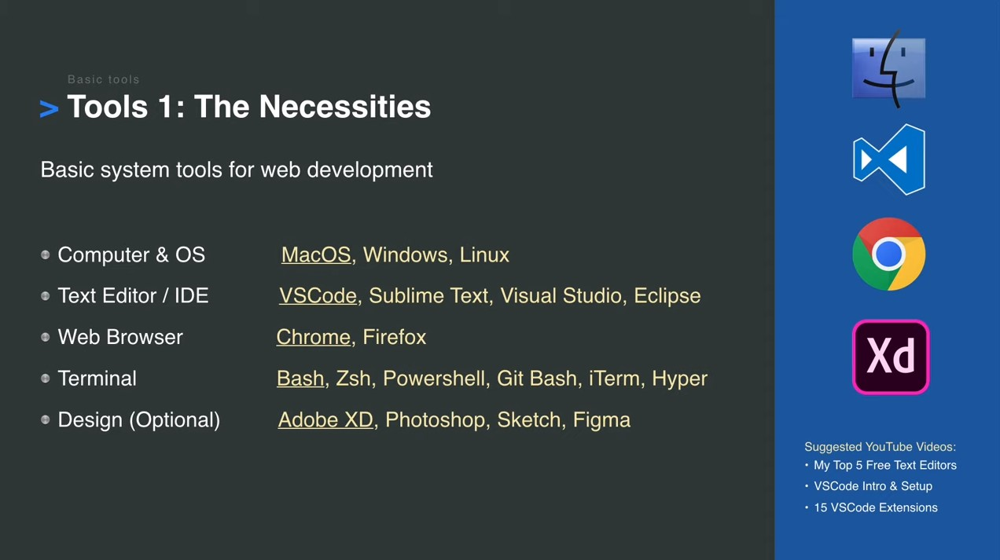

### Computer & OS
+ Linux
+ MacOS
+ Windows

### Text Editor / IDE
+ [Eclipse](https://www.eclipse.org/ide/)
+ [Sublime Text](https://www.sublimetext.com/)
+ [Visual Studio](https://visualstudio.microsoft.com/)
+ [Visual Studio Code](https://code.visualstudio.com/)

+ [Shearer's Text Editor Links](https://github.com/andrews1022/web-development-2020-course-list#text-editors)
+ [Shearer's IDE Links](https://github.com/andrews1022/web-development-2020-course-list#ides)

+ Suggested YouTube Videos:
    + [My Top 5 Free Text Editors For Web Development](https://www.youtube.com/watch?v=AJnhqf5IRC4)
    + [Visual Studio Code Intro & Setup](https://www.youtube.com/watch?v=fnPhJHN0jTE)
    + [15 VS Code Extensions for Front-End Developers in 2019](https://www.youtube.com/watch?v=LdF2RcelRg0)

### Browser
+ [Chrome](https://www.google.com/chrome/)
+ [Firefox](https://www.mozilla.org/en-CA/firefox/)

+ [Shearer's Links](https://github.com/andrews1022/web-development-2020-course-list#browser)

### Terminal
+ [Bash](https://www.gnu.org/software/bash/)
+ [Zsh](https://www.zsh.org/)
+ [Powershell](https://docs.microsoft.com/en-us/powershell/)
+ [Git Bash](https://git-scm.com/downloads)
+ [iTerm2](https://www.iterm2.com/)
+ [Hyper](https://hyper.is/)

### Design (Optional)
+ [Adobe XD](https://www.adobe.com/ca/products/xd.html)
+ [Figma](https://www.figma.com/)
+ [Photoshop](https://www.photoshop.com/)
+ [Sketch](https://www.sketch.com/)

+ [Shearer's Links](https://github.com/andrews1022/web-development-2020-course-list#design)

### UI/UX (Optional)
+ [Shearer's Links](https://github.com/andrews1022/web-development-2020-course-list#uiux)

## The Building Blocks ([7:10](https://www.youtube.com/watch?v=0pThnRneDjw&t=430s))
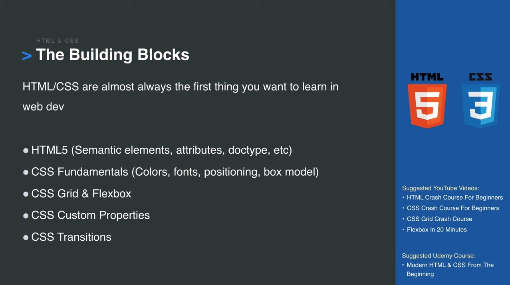

### HTML
+ [HTML5](https://developer.mozilla.org/en-US/docs/Web/Guide/HTML/HTML5)
+ Suggested YouTube Videos:
    + [HTML Crash Course For Absolute Beginners](https://www.youtube.com/watch?v=UB1O30fR-EE)
+ Suggested Udemy Courses:
    + [Modern HTML & CSS From The Beginning](https://www.udemy.com/course/modern-html-css-from-the-beginning/)

### CSS
+ [CSS3](https://developer.mozilla.org/en-US/docs/Web/CSS)
+ Suggested YouTube Videos:
    + [CSS Crash Course For Absolute Beginners](https://www.youtube.com/watch?v=yfoY53QXEnI)
    + [CSS Grid Layout Crash Course](https://www.youtube.com/watch?v=jV8B24rSN5o)
    + [Flexbox in 20 Minutes](https://www.youtube.com/watch?v=JJSoEo8JSnc)
    
+ [Shearer's Links](https://github.com/andrews1022/web-development-2020-course-list#css)

### HTML & CSS
+ [Shearer's Links](https://github.com/andrews1022/web-development-2020-course-list#html--css)

## Responsive Design ([9:18](https://www.youtube.com/watch?v=0pThnRneDjw&t=558s))
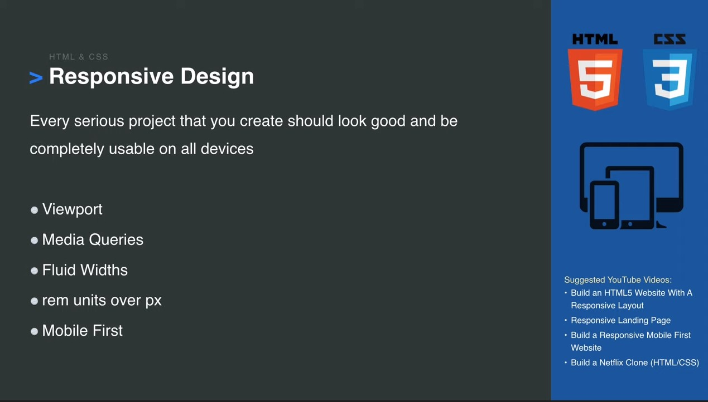

+ Suggested YouTube Videos:
    + [Build an HTML5 Website With A Responsive Layout](https://www.youtube.com/watch?v=Wm6CUkswsNw)
    + [Responsive Landing Page Using HTML & CSS (A Little jQuery)](https://www.youtube.com/watch?v=GJXXf3_dcng)
    + [Build a Responsive Mobile First Website](https://www.youtube.com/watch?v=XsEnj-1hG2o)
    + [Build a Netflix Clone](https://www.youtube.com/watch?v=P7t13SGytRk) (HTML / CSS)

## Custom Reusable CSS Components ([10:50](https://www.youtube.com/watch?v=0pThnRneDjw&t=650s))
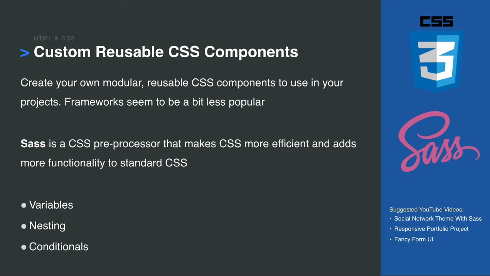

+ [Syntactically Awesome Style Sheets (Sass)](https://sass-lang.com/)
+ Suggested YouTube Videos:
    + [Social Network Theme With Sass](https://www.youtube.com/watch?v=IFM9hbapeA0)
    + [Responsive Portfolio Project](https://www.youtube.com/playlist?list=PLillGF-RfqbYoGoCjKoMOkVznV6aSXKzU)
    + [Fancy Form UI From Scratch](https://www.youtube.com/watch?v=AiTdhLc8JCo)

+ [Shearer's Links](https://github.com/andrews1022/web-development-2020-course-list#sass)

## CSS Frameworks (Choose One) ([12:26](https://www.youtube.com/watch?v=0pThnRneDjw&t=746s))
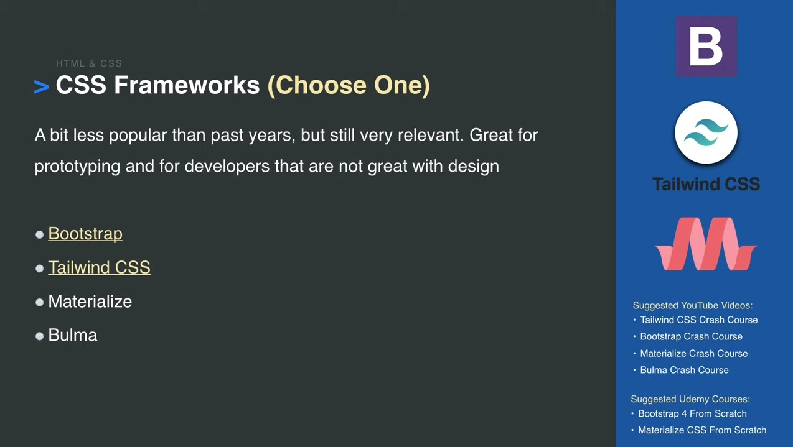

+ [Bootstrap](https://getbootstrap.com/)
+ Suggested YouTube Videos:
    + [Bootstrap Beginner Crash Course](https://www.youtube.com/watch?v=5GcQtLDGXy8)
+ Suggested Udemy Courses:
    + [Bootstrap 4 From Scratch With 5 Projects](https://www.udemy.com/course/bootstrap-4-from-scratch-with-5-projects/)
+ [Tailwind CSS](https://tailwindcss.com/)
+ Suggested YouTube Videos:
    + [Tailwind CSS Crash Course](https://www.youtube.com/watch?v=UBOj6rqRUME)
+ [Materialize](https://materializecss.com/)
+ Suggested YouTube Videos:
    + [Materialize Crash Course [Part 1]](https://www.youtube.com/watch?v=nqT8c5OFjEQ)
    + [Materialize Crash Course [Part 2]](https://www.youtube.com/watch?v=ZpduVPHZ5Aw)
+ Suggested Udemy Courses:
    + [Materialize From Scratch With 5 Projects](https://www.udemy.com/course/materialize-css-from-scratch-with-5-projects/)
+ [Bulma](https://bulma.io/)
+ Suggested YouTube Videos:
    + [Bulma CSS Framework Crash Course](https://www.youtube.com/watch?v=IiPQYQT2-wg)

## Vanilla JavaScript ([13:52](https://www.youtube.com/watch?v=0pThnRneDjw&t=832s))
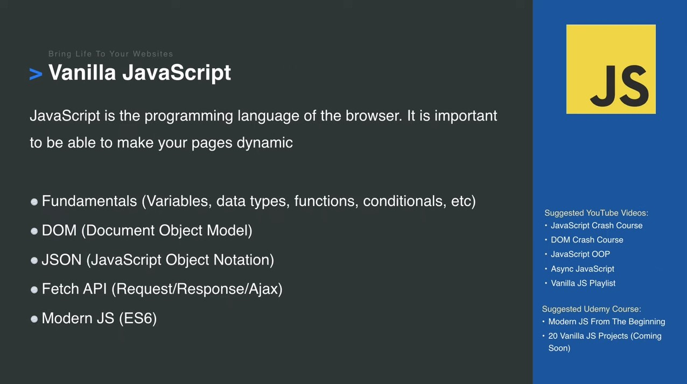

+ [JavaScript](https://developer.mozilla.org/en-US/docs/Web/JavaScript)
+ Suggested YouTube Videos:
    + [JavaScript Crash Course For Beginners](https://www.youtube.com/watch?v=hdI2bqOjy3c)
    + [JavaScript DOM Crash Course](https://www.youtube.com/playlist?list=PLillGF-RfqbYE6Ik_EuXA2iZFcE082B3s)
    + [JavaScript OOP Crash Course (ES5 & ES6)](https://www.youtube.com/watch?v=vDJpGenyHaA)
    + [Async JS Crash Course (Callbacks, Promises, Async Await)](https://www.youtube.com/watch?v=PoRJizFvM7s)
    + [Vanilla JS Playlist](https://www.youtube.com/playlist?list=PLillGF-RfqbbnEGy3ROiLWk7JMCuSyQtX)
+ Suggested Udemy Courses:
    + [Modern JavaScript From The Beginning](https://www.udemy.com/course/modern-javascript-from-the-beginning/)
    + [20 Web Projects With Vanilla JavaScript](https://www.udemy.com/course/web-projects-with-vanilla-javascript/)
    
+ [Shearer's Links](https://github.com/andrews1022/web-development-2020-course-list#vanilla-javascript)

## Tools 2 - Essential Dev Tools ([16:28](https://www.youtube.com/watch?v=0pThnRneDjw&t=988s))
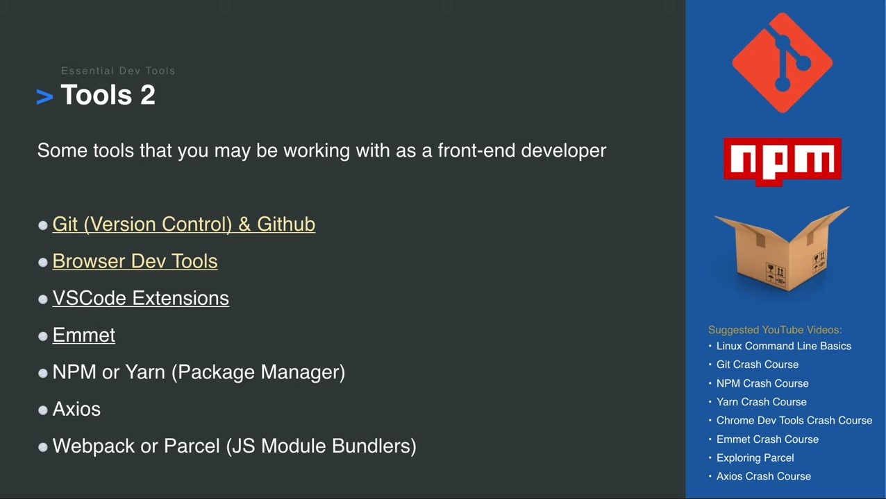

+ [Git](https://git-scm.com/) (Version Control) & [GitHub](https://github.com/)
+ [Browser Dev Tools](https://en.wikipedia.org/wiki/Web_development_tools)
+ [VSCode Extensions](https://marketplace.visualstudio.com/)
+ [Emmet](https://emmet.io/)
+ [NPM](https://www.npmjs.com/) or [Yarn](https://yarnpkg.com/) (Package Manager)
+ [Axios](https://github.com/axios/axios)
+ [Webpack](https://webpack.js.org/) or [Parcel](https://parceljs.org/) (JS Module Bundlers)
+ Suggested YouTube Videos:
    + [Linux Tutorial - Basic Command Line](https://www.youtube.com/watch?v=cBokz0LTizk)
    + [Git & GitHub Crash Course For Beginners](https://www.youtube.com/watch?v=SWYqp7iY_Tc)
    + [NPM Crash Course](https://www.youtube.com/watch?v=jHDhaSSKmB0)
    + [Yarn Crash Course](https://www.youtube.com/watch?v=g9_6KmiBISk)
    + [Google Chrome Developer Tools Crash Course](https://www.youtube.com/watch?v=x4q86IjJFag)
    + [Emmet Crash Course](https://www.youtube.com/watch?v=5BIAdWNcr8Y)
    + [Webpack Crash Course](https://www.youtube.com/watch?v=lziuNMk_8eQ)
    + [Exploring The Parcel Application Bundler](https://www.youtube.com/watch?v=DYZTFooDB24)
    + [Axios Crash Course | HTTP Library](https://www.youtube.com/watch?v=6LyagkoRWYA)
    
+ [Shearer's Links](https://github.com/andrews1022/web-development-2020-course-list#tools-2---essential-dev-tools)

## Basic Deployment ([20:45](https://www.youtube.com/watch?v=0pThnRneDjw&t=1245s))
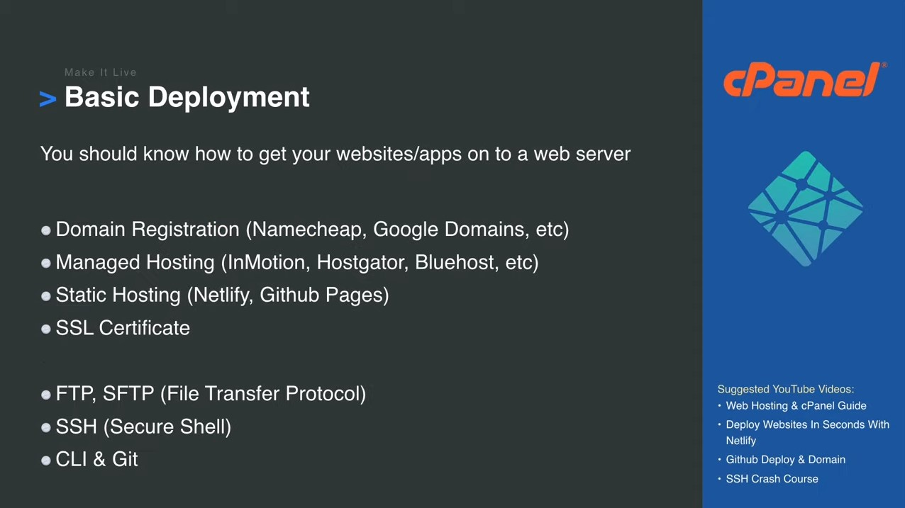

+ [Domain Registration](https://whois.icann.org/en/domain-name-registration-process) ([NameCheap](https://www.namecheap.com/), [Google Domains](https://domains.google/), etc.)
+ [Managed Hosting](https://en.wikipedia.org/wiki/Dedicated_hosting_service) ([InMotion](https://www.inmotionhosting.com/), [Hostgator](https://www.hostgator.com/), [Bluehost](https://www.bluehost.com/), etc.)
+ [Static Hosting](https://en.wikipedia.org/wiki/Static_web_page) ([Netlify](https://www.netlify.com/), [GitHub Pages](https://pages.github.com/))
+ [SSL Certificate](https://us.norton.com/internetsecurity-how-to-ssl-certificates-what-consumers-need-to-know.html#:~:text=An%20SSL%20certificate%20is%20a,the%20time%20of%20certificate%20issuance.)

+ [FTP](https://en.wikipedia.org/wiki/File_Transfer_Protocol), [SFTP](https://en.wikipedia.org/wiki/SSH_File_Transfer_Protocol) (File Transfer Protocol)
+ [SSH](https://en.wikipedia.org/wiki/Secure_Shell) (Secure Shell)
+ [CLI & Git](https://git-scm.com/docs/gitcli)
+ Suggested YouTube Videos:
    + [Web Hosting & cPanel Guide - How To Easily Upload Your Website](https://www.youtube.com/watch?v=UN7S4zd8h-k)
    + [Deploy Websites in Seconds With Netlify](https://www.youtube.com/watch?v=bjVUqvcCnxM)
    + [Github Pages Deploy & Domain](https://www.youtube.com/watch?v=SKXkC4SqtRk)
    + [SSH Crash Course | With Some DevOps](https://www.youtube.com/watch?v=hQWRp-FdTpc)

## Where To Now? ([24:12](https://www.youtube.com/watch?v=0pThnRneDjw&t=1452s))
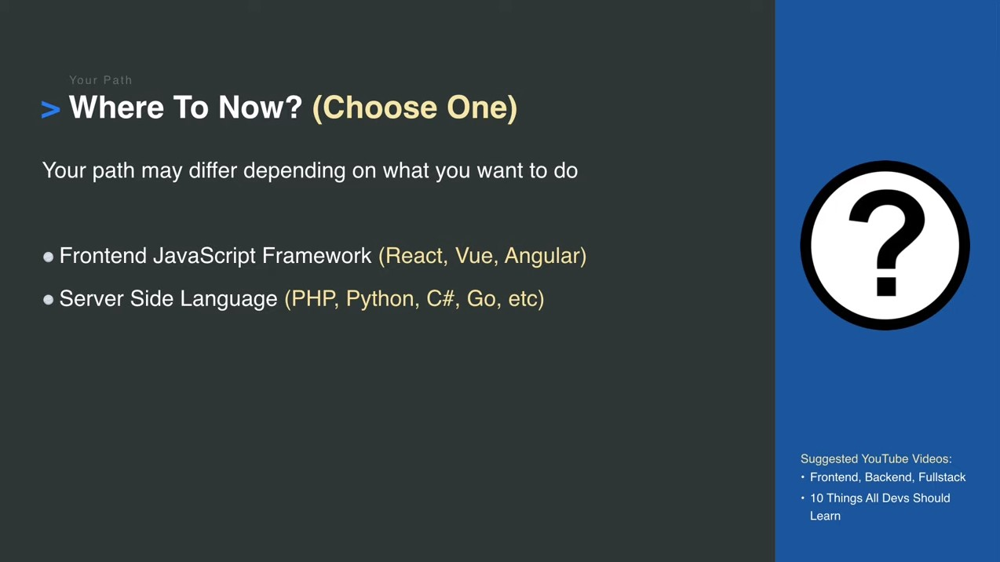

+ Suggested YouTube Videos:
    + [Front End, Back End & Full Stack Web Development](https://www.youtube.com/watch?v=eRZHzi3l-4Q)
    + [10 Things All Web Developers Should Learn](https://www.youtube.com/watch?v=uPMm4dJmSoM)

## Front-End Framework (Choose One) ([25:00](https://www.youtube.com/watch?v=0pThnRneDjw&t=1500s))
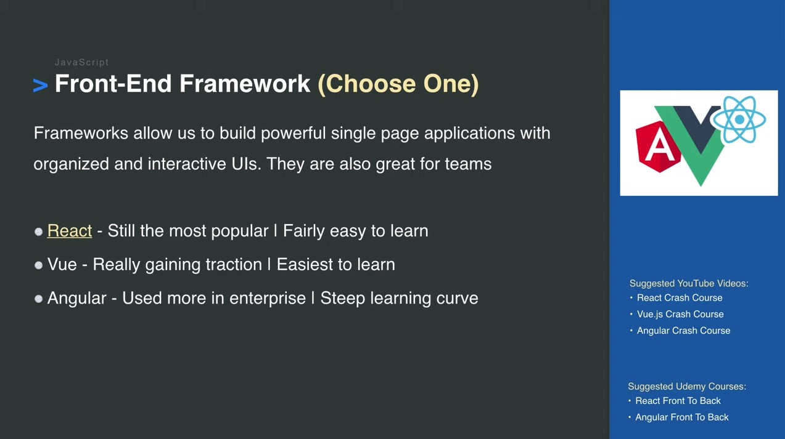

+ [React](https://reactjs.org/)
+ [Vue](https://vuejs.org/)
+ [Angular](https://angular.io/)
+ Suggested YouTube Videos:
    + [React JS Crash Course](https://www.youtube.com/watch?v=sBws8MSXN7A)
    + [Vue JS Crash Course](https://www.youtube.com/watch?v=Wy9q22isx3U)
    + [Angular Crash Course](https://www.youtube.com/watch?v=Fdf5aTYRW0E)
+ Suggested Udemy Courses:
    + [React Front To Back](https://www.udemy.com/course/modern-react-front-to-back/)
    + [Angular Front To Back](https://www.udemy.com/course/angular-4-front-to-back/)
    
+ [Shearer's Links](https://github.com/andrews1022/web-development-2020-course-list#front-end-framework--state-management-choose-one)

## Svelte ([27:14](https://www.youtube.com/watch?v=0pThnRneDjw&t=1634s))
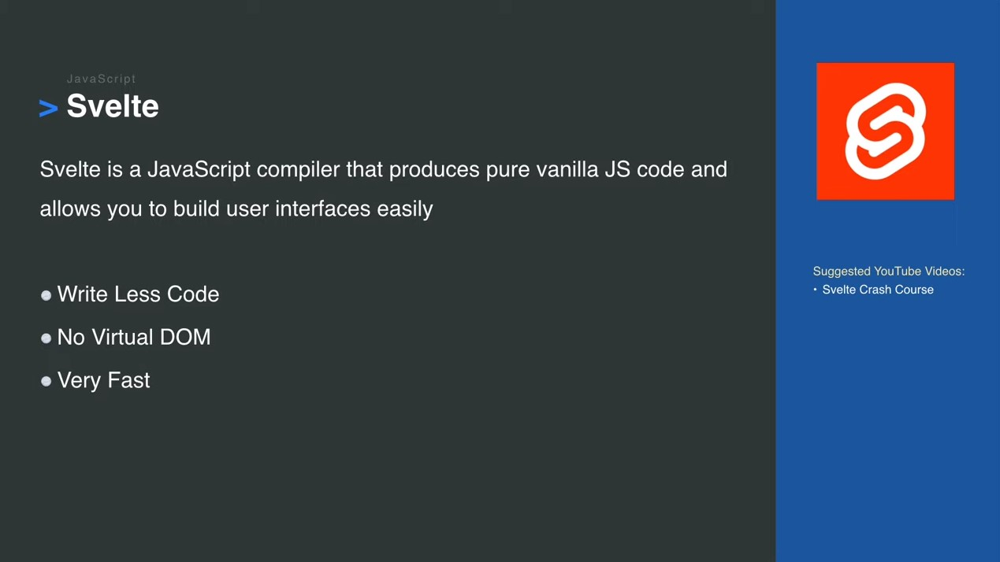

+ [Svelte](https://svelte.dev/)
+ Suggested YouTube Videos:
    + [Svelte Crash Course](https://www.youtube.com/watch?v=uK2RnIzrQ0M)
    
+ [Shearer's Links](https://github.com/andrews1022/web-development-2020-course-list#svelte-1)

## State Management ([28:32](https://www.youtube.com/watch?v=0pThnRneDjw&t=1712s))
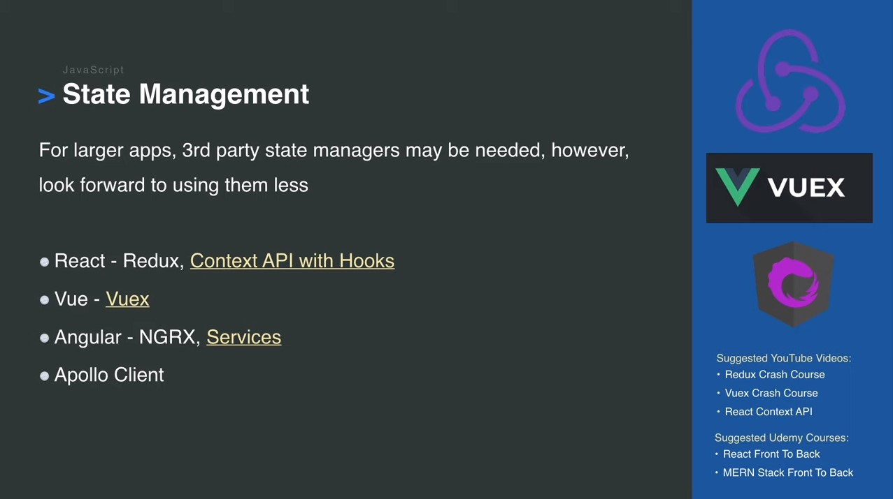

+ [React - Redux](https://react-redux.js.org/), [Context API with Hooks](https://medium.com/simply/state-management-with-react-hooks-and-context-api-at-10-lines-of-code-baf6be8302c)
+ Vue - [Vuex](https://vuex.vuejs.org/)
+ Angular - [NGRX](https://ngrx.io/), [Services](https://angular.io/guide/architecture-services)
+ [Apollo Client](https://www.apollographql.com/docs/react/)
+ Suggested YouTube Videos:
    + [Redux Crash Course With React](https://www.youtube.com/watch?v=93p3LxR9xfM)
    + [Vuex Crash Course | State Management](https://www.youtube.com/watch?v=5lVQgZzLMHc)
    + [Build an Expense Tracker | React Hooks & Context API](https://www.youtube.com/watch?v=XuFDcZABiDQ)
+ Suggested Udemy Courses:
    + [MERN Stack Front To Back: Full Stack React, Redux & Node.js](https://www.udemy.com/course/mern-stack-front-to-back/)

## Server-Side Rendering ([30:40](https://www.youtube.com/watch?v=0pThnRneDjw&t=1840s))
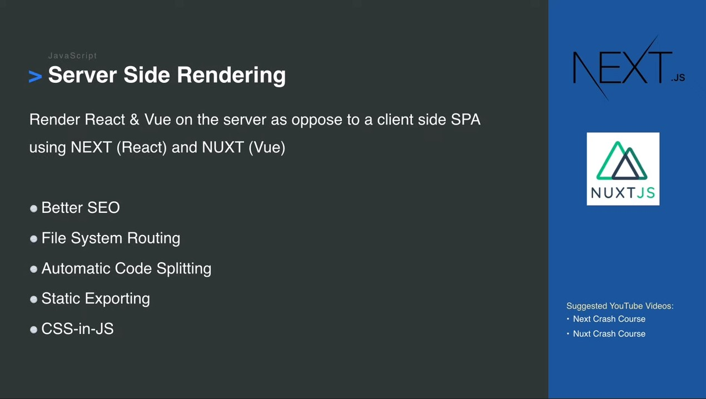

+ [Next.js](https://nextjs.org/)
+ [Nuxt.js](https://nuxtjs.org/)
+ [NestJS](https://nestjs.com/)
+ Suggested YouTube Videos:
    + [Next.js Crash Course - Server Side React](https://www.youtube.com/watch?v=IkOVe40Sy0U)
    + [Nuxt JS Crash Course](https://www.youtube.com/watch?v=ltzlhAxJr74)
    + [NestJS Crash Course](https://www.youtube.com/watch?v=wqhNoDE6pb4)

+ [Shearer's Links](https://github.com/covuworie/web-development-2020-course-list#server-side-rendering)

## Static Site Generators ([33:04](https://www.youtube.com/watch?v=0pThnRneDjw&t=1984s))
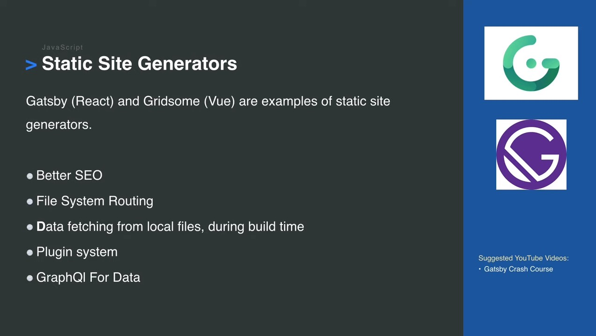

+ [GatsbyJS](https://www.gatsbyjs.org/)
+ [Gridsome](https://gridsome.org/)
+ [Scully](https://github.com/scullyio/scully)
+ Suggested YouTube Videos:
    + [Gatsby JS Crash Course](https://www.youtube.com/watch?v=6YhqQ2ZW1sc)

+ [Shearer's Links](https://github.com/andrews1022/web-development-2020-course-list#static-site-generators)

## TypeScript ([35:05](https://www.youtube.com/watch?v=0pThnRneDjw&t=2105s))
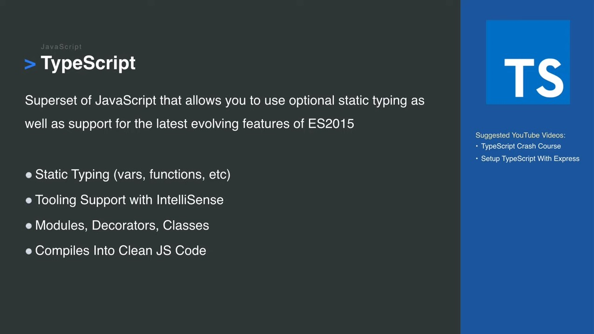

+ [TypeScript](https://www.typescriptlang.org/)
+ Suggested YouTube Videos:
    + [TypeScript Crash Course](https://www.youtube.com/watch?v=rAy_3SIqT-E)
    + [Setup TypeScript With Node & Express](https://www.youtube.com/watch?v=zRo2tvQpus8)

+ [Shearer's Links](https://github.com/andrews1022/web-development-2020-course-list#typescript)

## Server-Side Language (Choose One) ([37:42](https://www.youtube.com/watch?v=0pThnRneDjw&t=2262s))
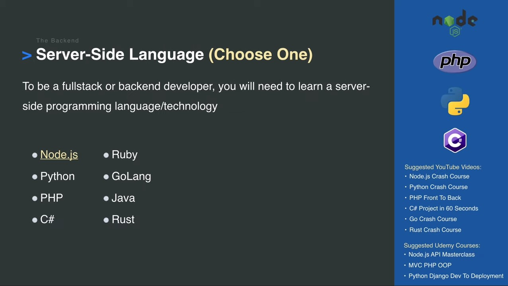

+ [Node.js](https://nodejs.org/)
+ [Python](https://www.python.org/)
+ [PHP](https://www.php.net/)
+ [C#](https://docs.microsoft.com/en-us/dotnet/csharp/)
+ [Ruby](https://www.ruby-lang.org/en/)
+ [GoLang](https://golang.org/)
+ [Java](https://www.java.com/)
+ [Rust](https://www.rust-lang.org/)
+ Suggested YouTube Videos:
    + [Node.js Tutorial For Absolute Beginners](https://www.youtube.com/watch?v=U8XF6AFGqlc)
    + [Python Crash Course For Beginners](https://www.youtube.com/watch?v=JJmcL1N2KQs)
    + [PHP Front To Back](https://www.youtube.com/playlist?list=PLillGF-Rfqbap2IB6ZS4BBBcYPagAjpjn)
    + [Build a C# .NET Application in 60 Minutes](https://www.youtube.com/watch?v=GcFJjpMFJvI&list=LL1eflqsFiNRyUj1o2JFypVg&index=515)
    + [Go / Golang Crash Course](https://www.youtube.com/watch?v=SqrbIlUwR0U)
    + [Rust Crash Course | Rustlang](https://www.youtube.com/watch?v=zF34dRivLOw)
+ Suggested Udemy Courses:
    + [Node.js API Masterclass With Express & MongoDB](https://www.udemy.com/course/nodejs-api-masterclass/)
    + [Object Oriented PHP & MVC](https://www.udemy.com/course/object-oriented-php-mvc/)
    + [Python Django Dev To Deployment](https://www.udemy.com/course/python-django-dev-to-deployment/)

+ [Shearer's Links](https://github.com/andrews1022/web-development-2020-course-list#server-side-language-choose-one)

## Server-Side Framework (Choose One) ([42:52](https://www.youtube.com/watch?v=0pThnRneDjw&t=2572s))
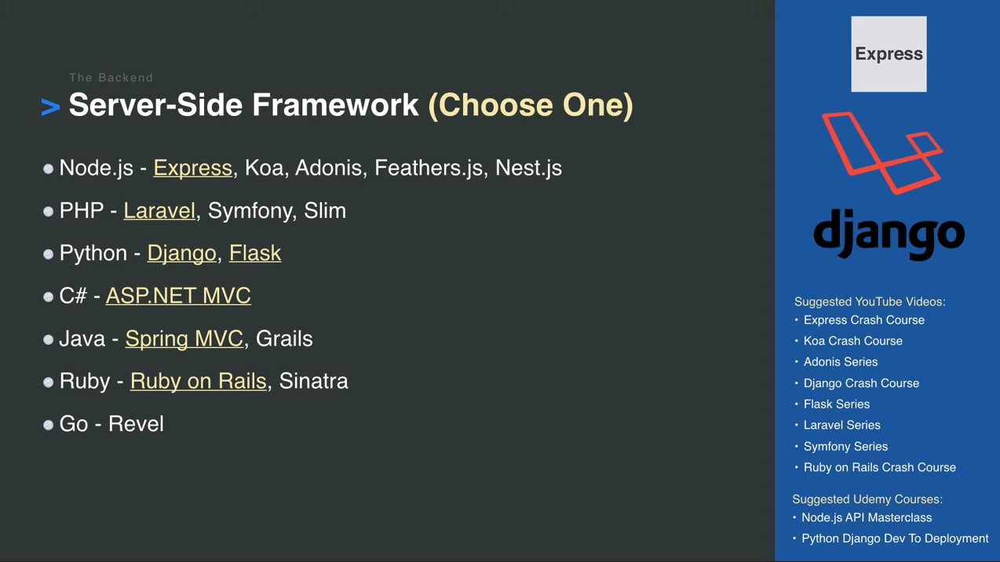

+ Node.js - [Express](https://expressjs.com/), [Koa](https://koajs.com/), [Adonis](https://adonisjs.com/), [Feathers.js](https://feathersjs.com/), [Nest.js](https://nestjs.com/)
+ PHP - [Laravel](https://laravel.com/), [Symfony](https://symfony.com/), [Slim](http://www.slimframework.com/)
+ Python -[Django](https://www.djangoproject.com/), [Flask](https://flask.palletsprojects.com/)
+ C# - [ASP.NET MVC](https://docs.microsoft.com/en-us/aspnet/mvc/overview/getting-started/introduction/getting-started)
+ Java - [Spring MVC](https://spring.io/), [Grails](https://grails.org/)
+ Ruby - [Ruby on Rails](https://rubyonrails.org/), [Sinatra](http://sinatrarb.com/)
+ Go - [Revel](https://revel.github.io/)
+ Suggested YouTube Videos:
    + [Express JS Crash Course](https://www.youtube.com/watch?v=L72fhGm1tfE)
    + [Koa.js Crash Course - Modern & Minimalist Node.js](https://www.youtube.com/watch?v=z84uTk5zmak)
    + [Getting Started With Adonis JS 4.0](https://www.youtube.com/playlist?list=PLillGF-RfqbY6wY9yZjCpSMzvhn-icuG6)
    + [Django Crash Course](https://www.youtube.com/watch?v=e1IyzVyrLSU)
    + [Python Flask From Scratch](https://www.youtube.com/playlist?list=PLillGF-RfqbbbPz6GSEM9hLQObuQjNoj_)
    + [Laravel From Scratch](https://www.youtube.com/playlist?list=PLillGF-RfqbYhQsN5WMXy6VsDMKGadrJ-)
    + [Up & Running With Symfony 4](https://www.youtube.com/playlist?list=PLillGF-Rfqba-PQBBEf14-fi6LafvvDYS)
    + [Ruby On Rails In 60 Minutes](https://www.youtube.com/watch?v=pPy0GQJLZUM)
+ Suggested Udemy Courses:
    + [Node.js API Masterclass With Express & MongoDB](https://www.udemy.com/course/nodejs-api-masterclass/)
    + [Python Django Dev To Deployment](https://www.udemy.com/course/python-django-dev-to-deployment/)
 
+ [Shearer's Links](https://github.com/andrews1022/web-development-2020-course-list#server-side-framework-choose-one)

## Database (Choose One) ([47:37](https://www.youtube.com/watch?v=0pThnRneDjw&t=2857s))
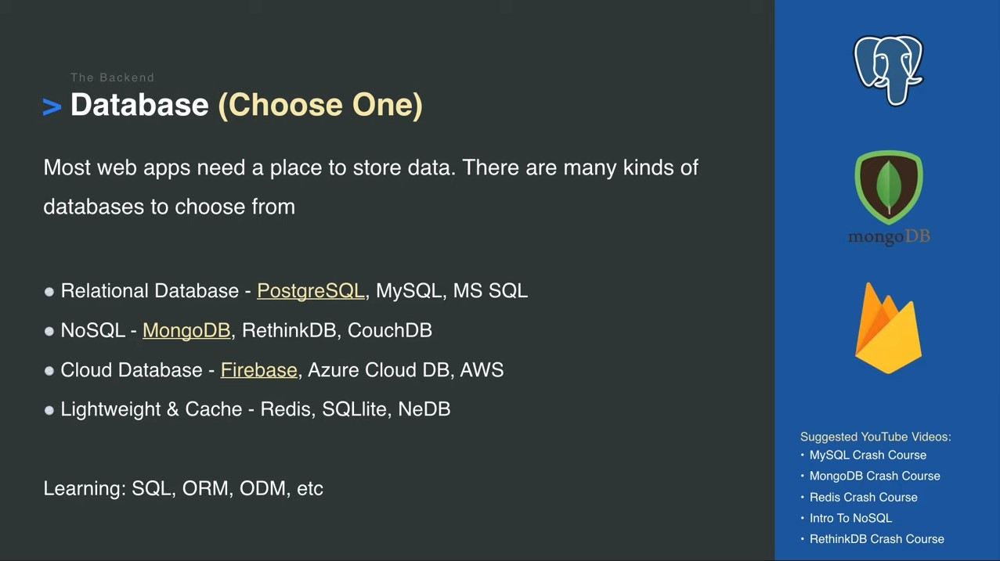

+ Relational Database - [PostGreSQL](https://www.postgresql.org/), [MySQL](https://www.mysql.com/), [MS SQL](https://www.microsoft.com/en-us/sql-server)
+ NoSQL - [MongoDB](https://www.mongodb.com/), [RethinkDB](https://rethinkdb.com/), [CouchDB](http://couchdb.apache.org/)
+ Cloud Database - [Firebase](https://firebase.google.com/), [Azure Cloud DB](https://azure.microsoft.com/en-us/product-categories/databases/), [AWS](https://aws.amazon.com/products/databases/)
+ Lightweight & Cache - [Redis](https://redis.io/), [SQLite](https://www.sqlite.org/), [NeDB](https://github.com/louischatriot/nedb)
+ Suggested YouTube Videos:
    + [MySQL Crash Course | Learn SQL](https://www.youtube.com/watch?v=9ylj9NR0Lcg)
    + [MongoDB Crash Course](https://www.youtube.com/watch?v=-56x56UppqQ)
    + [Redis Crash Course Tutorial](https://www.youtube.com/watch?v=Hbt56gFj998)
    + [An Introduction To NoSQL Databases](https://www.youtube.com/watch?v=uD3p_rZPBUQ)
    + [RethinkDB & ReQL Crash Course](https://www.youtube.com/watch?v=pW3PFtchHDc)
    
+ [Shearer's Links](https://github.com/andrews1022/web-development-2020-course-list#database-choose-one)
    

## GraphQL ([52:08](https://www.youtube.com/watch?v=0pThnRneDjw&t=3128s))
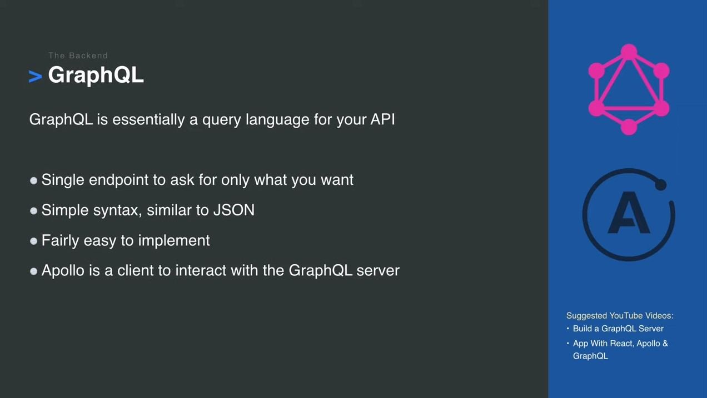

+ [GraphQL](https://graphql.org/)
+ [Apollo](https://www.apollographql.com/)
+ Suggested YouTube Videos:
    + [Build a GraphQL Server](https://www.youtube.com/playlist?list=PLillGF-RfqbYZty73_PHBqKRDnv7ikh68)
    + [GraphQL With React & Apollo ](https://www.youtube.com/playlist?list=PLillGF-RfqbZrjw48EXLdM4dsOhURCLZx)

+ [Shearer's Links](https://github.com/andrews1022/web-development-2020-course-list#graphql-1)

## Content Management ([53:41](https://www.youtube.com/watch?v=0pThnRneDjw&t=3221s))
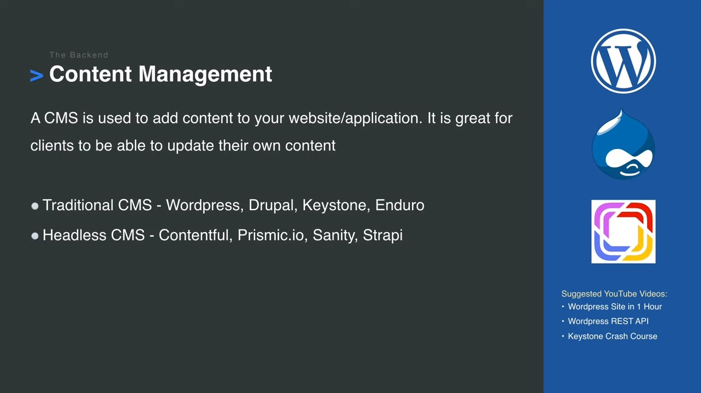

+ Traditional CMS - [Wordpress](https://wordpress.com/), [Drupal](https://www.drupal.org/), [Keystone](https://keystonejs.com/), [Enduro](http://www.endurojs.com/)
+ Headless CMS - [Contentful](https://www.contentful.com/), [Prismic.io](https://prismic.io/), [Sanity](https://www.sanity.io/), [Strapi](https://strapi.io/)
+ Suggested YouTube Videos:
    + [Wordpress Site in 1 Hour](https://www.youtube.com/watch?v=66n1DFrmc0Q)
    + [Exploring The Wordpress REST API & React Integration](https://www.youtube.com/watch?v=fFNXWinbgro)
    + [Keystone JS Tutorial - A Node.js CMS](https://www.youtube.com/watch?v=DPXDFeUEk3g)

+ [Shearer's Links](https://github.com/andrews1022/web-development-2020-course-list#content-management)

## Deployment & DevOps ([55:22](https://www.youtube.com/watch?v=0pThnRneDjw&t=3322s))
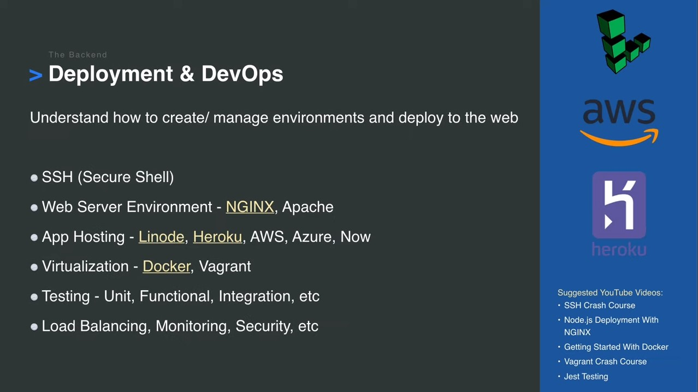

+ [SSH](https://www.ssh.com/ssh/) (Secure Shell)
+ Web Server Environment - [NGINX](https://nginx.org/), [Apache HTTP Server](https://httpd.apache.org/)
+ App Hosting - [Linode](https://www.linode.com/), [Heroku](https://www.heroku.com/), [AWS](https://aws.amazon.com/), [Azure](https://azure.microsoft.com/en-us/), [Now](https://nowhosting.net/)
+ Virtualization - [Docker](https://www.docker.com/), [Vagrant](https://www.vagrantup.com/)
+ Testing - Unit, Functional, Integration, etc.
+ Load Balancing, Monitoring, Security, etc.
+ Suggested YouTube Videos:
    + [SSH Crash Course | With Some DevOps](https://www.youtube.com/watch?v=hQWRp-FdTpc)
    + [Full Node.js Deployment - NGINX, SSL With Lets Encrypt](https://www.youtube.com/watch?v=oykl1Ih9pMg)
    + [Exploring Docker](https://www.youtube.com/playlist?list=PLillGF-Rfqbb6vZqT-Lzi9Al_noaY5LAs)
    + [Vagrant Crash Course](https://www.youtube.com/watch?v=vBreXjkizgo)
    + [Jest Crash Course - Unit Testing in JavaScript](https://www.youtube.com/watch?v=7r4xVDI2vho)

+ [Shearer's Links](https://github.com/andrews1022/web-development-2020-course-list#deployment--devops)

## Mobile Development (Choose One) ([59:51](https://www.youtube.com/watch?v=0pThnRneDjw&t=3591s))
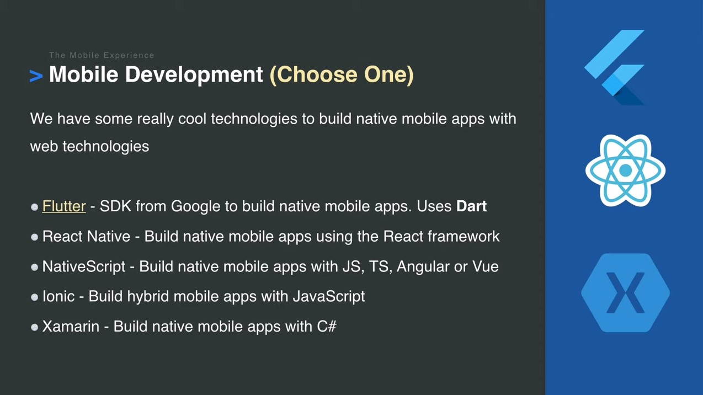

+ [Flutter](https://flutter.dev/)
+ [React Native](https://reactnative.dev/)
+ [NativeScript](https://nativescript.org/)
+ [Ionic](https://ionicframework.com/)
+ [Xamarin](https://dotnet.microsoft.com/apps/xamarin)

+ [Shearer's Links](https://github.com/andrews1022/web-development-2020-course-list#mobile-development-choose-one)

## PWA: Progressive Web Apps ([1:01:43](https://www.youtube.com/watch?v=0pThnRneDjw&t=3703s))
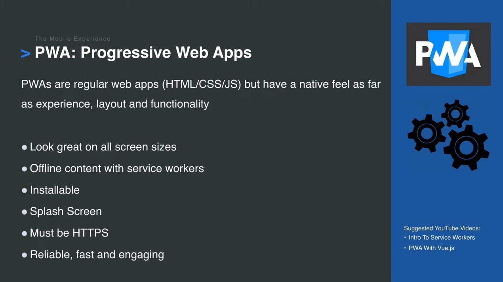

+ [Progressive Web Apps](https://developer.mozilla.org/en-US/docs/Web/Progressive_web_apps) (PWAs)
+ Suggested YouTube Videos:
    + [Intro To Service Workers & Caching](https://www.youtube.com/watch?v=ksXwaWHCW6k)
    + [Build a PWA With Vue & Ionic 4](https://www.youtube.com/watch?v=6H1wftPS0oo)

+ [Shearer's Links](https://github.com/andrews1022/web-development-2020-course-list#progressive-web-apps)

## Desktop Apps with Electron ([1:03:19](https://www.youtube.com/watch?v=0pThnRneDjw&t=3799s))
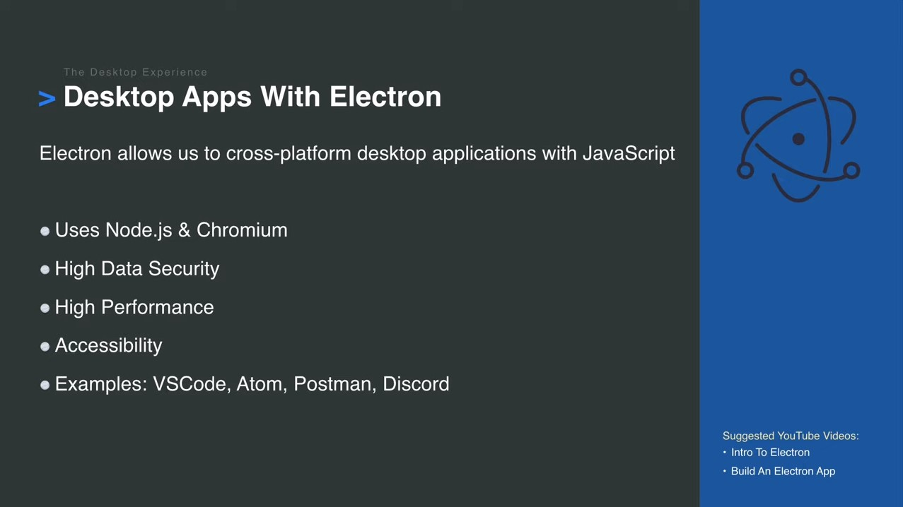

+ [Electron](https://www.electronjs.org/)
+ Suggested YouTube Videos:
    + [An Intro To Electron - Desktop Apps with JavaScript](https://www.youtube.com/watch?v=mr9Mtm_TRpw&list=LLB12cCeOKb29sDbNAmTP2fA&index=270)
    + [Build an Electron App in Under 60 Minutes](https://www.youtube.com/watch?v=kN1Czs0m1SU)

+ [Shearer's Links](https://github.com/andrews1022/web-development-2020-course-list#electron)

## JAMstack ([1:04:24](https://www.youtube.com/watch?v=0pThnRneDjw&t=3864s))
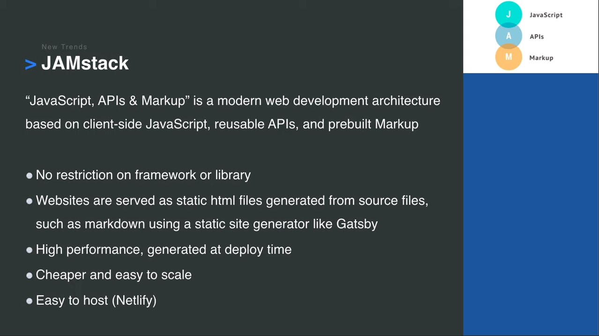

+ [Jamstack](https://jamstack.org/) (JavaScript, APIs & Markup)

## Serverless Architecture ([1:06:10](https://www.youtube.com/watch?v=0pThnRneDjw&t=3970s))
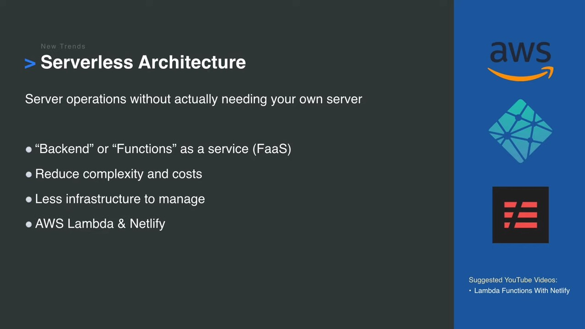

+ [Serverless](https://www.serverless.com/)
+ [AWS Lambda](https://aws.amazon.com/lambda/) & [Netlify](https://www.netlify.com/)
+ Suggested YouTube Videos:
    + [Serverless Lambda Functions](https://www.youtube.com/watch?v=drJwMlD9Mjo)

+ [Shearer's Links](https://github.com/andrews1022/web-development-2020-course-list#aws-lambda)

## API-First Design ([1:07:24](https://www.youtube.com/watch?v=0pThnRneDjw&t=4044s))
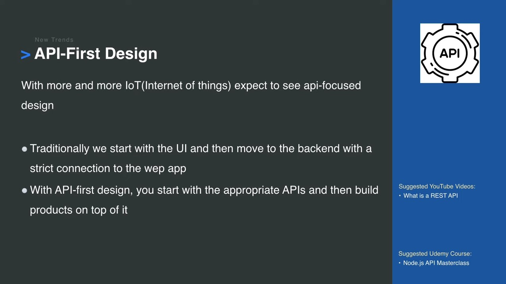

+ [API First Design](https://swagger.io/resources/articles/adopting-an-api-first-approach/)
+ Suggested YouTube Videos:
    + [What Is A RESTful API? Explanation of REST & HTTP](https://www.youtube.com/watch?v=Q-BpqyOT3a8)
+ Suggested Udemy Courses:
    + [Node.js API Masterclass With Express & MongoDB](https://www.udemy.com/course/nodejs-api-masterclass/)

+ [Shearer's Links](https://github.com/andrews1022/web-development-2020-course-list#apis)

## Machine Learning / AI & The Web ([1:08:12](https://www.youtube.com/watch?v=0pThnRneDjw&t=4092s))
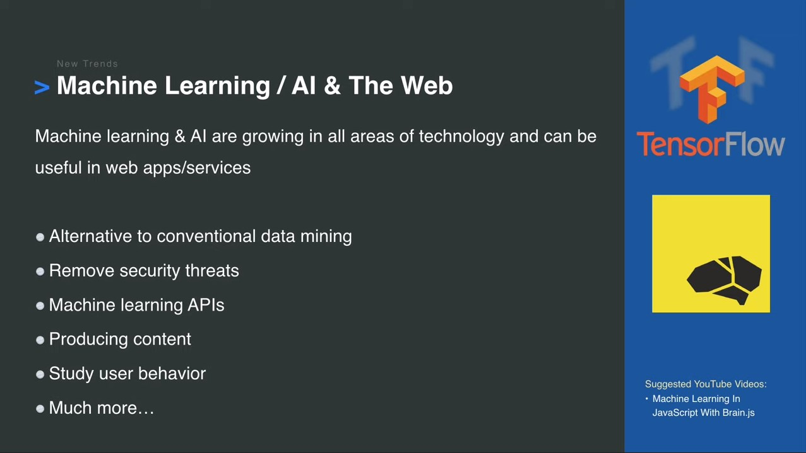

+ [Machine Learning](https://en.wikipedia.org/wiki/Machine_learning)
+ [Artificial Intelligence](https://en.wikipedia.org/wiki/Artificial_intelligence) (AI)
+ Suggested YouTube Videos:
    + [Simple Machine Learning With JavaScript - Brain.js](https://www.youtube.com/watch?v=RVMHhtTqUxc)

+ [Shearer's Links](https://github.com/andrews1022/web-development-2020-course-list#machine-learning--ai--the-web)

## Speech Recognition ([1:09:03](https://www.youtube.com/watch?v=0pThnRneDjw&t=4143s))
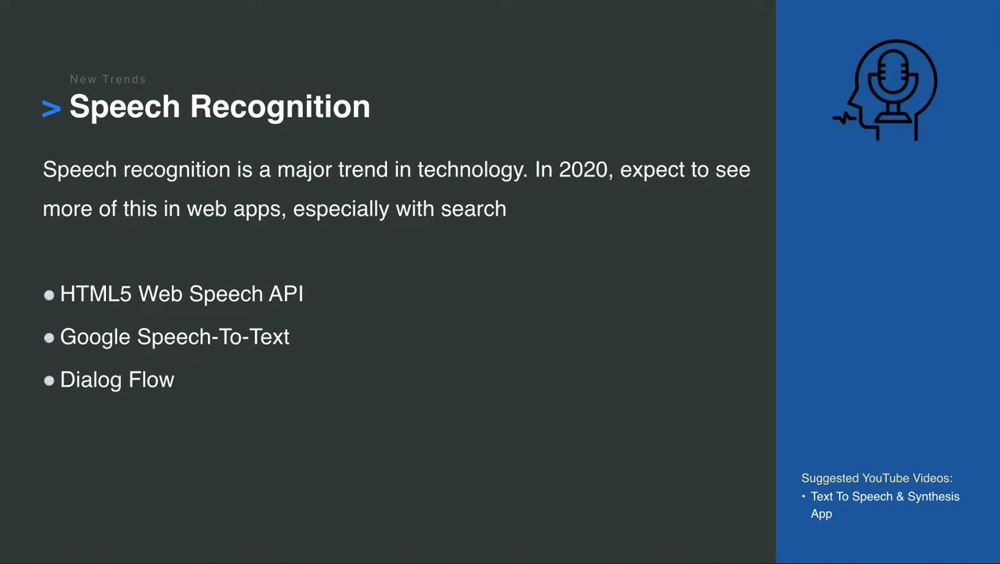

+ [Speech Recognition](https://en.wikipedia.org/wiki/Speech_recognition)
+ [HTML5 Web Speech API](https://developer.mozilla.org/en-US/docs/Web/API/Web_Speech_API/Using_the_Web_Speech_API)
+ [Google Speech-To-Text](https://cloud.google.com/speech-to-text)
+ [Dialogflow](https://cloud.google.com/dialogflow)
+ Suggested YouTube Videos:
    + [Text To Speech & Synthesis App - JavaScript & Web Speech API](https://www.youtube.com/watch?v=ZORXxxP49G8)

## Web Assembly ([1:09:42](https://www.youtube.com/watch?v=0pThnRneDjw&t=4182s))
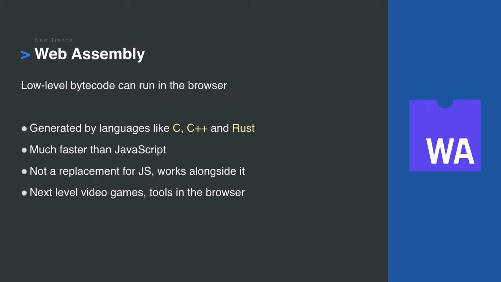

+ [Web Assembly](https://webassembly.org/)

___

If all that wasn't enough then here are even more links:

[Shearer's Other Links](https://github.com/andrews1022/web-development-2020-course-list#full-stack-beginner)
